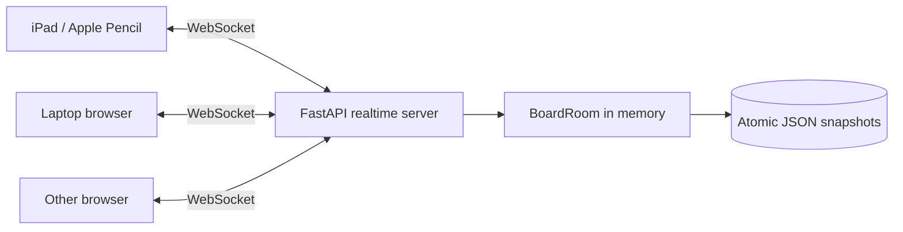

# Architecture

## Goal

`local-board` — локальная realtime-доска: один Linux-хост держит состояние, а iPad, ноутбуки и другие браузеры открывают одну и ту же доску и видят изменения друг друга во время рисования.

Главный сценарий: пользователь пишет Apple Pencil на iPad → штрих сразу рисуется локально → точки отправляются через WebSocket → сервер применяет событие → остальные клиенты получают его и дорисовывают тот же штрих.

## Components



### Frontend

- native Canvas 2D + Pointer Events;
- Apple Pencil uses `pointerType=pen` and pressure;
- touch on canvas pans/zooms instead of leaving accidental ink;
- local stroke is rendered optimistically before network round-trip;
- viewport (`x/y/zoom`) is local per browser and is never synchronized.

### Backend

- FastAPI serves the app and WebSocket endpoint;
- one `BoardRoom` is the authoritative in-memory state for one board id;
- each mutation has `op_id`;
- sender receives `ack`;
- server remembers recent `op_id` values and ignores retries, making reconnect resend idempotent;
- completed mutations are persisted atomically to JSON.

## Realtime protocol

Client mutations:

- `stroke.begin`
- `stroke.append`
- `stroke.end`
- `stroke.delete`
- `stroke.restore`
- `board.clear`

Server messages:

- `snapshot` — full current board after connect/reconnect;
- `event` — mutation from another client;
- `ack` — confirms mutation from this client;
- `presence` — current connected-client count;
- `error` — rejected protocol message.

### Reconnect

The browser keeps unacknowledged operations in an outbox. After reconnect:

1. server sends the authoritative snapshot;
2. browser overlays its pending operations locally;
3. pending operations are resent;
4. duplicate `op_id` values are acknowledged but not applied twice.

This avoids losing a just-written stroke during a short Wi-Fi interruption.

## Persistence

By default, runtime data is outside the git checkout:

```text
~/.local/share/local-board/boards/<board-id>.json
```

Override with `LOCAL_BOARD_DATA_DIR`.

JSON is enough for a local single-host board and keeps setup simple. If the project later needs multiple backend processes or internet-scale rooms, replace the room/persistence layer with a shared event/state backend (for example Redis + durable DB) without changing the browser protocol.

## Concurrency and limits

Current target is a trusted local network and a small collaborative room. The server is single-process and keeps active boards in memory. Protocol validation caps point batch size and stroke size to avoid unbounded client payloads.

## Deliberate non-goals for this version

- authentication/permissions;
- internet-facing deployment hardening;
- multi-process horizontal scaling;
- CRDT for arbitrary object editing;
- text/shapes/images/PDF objects.

Those can be added after the core realtime ink path is stable.
