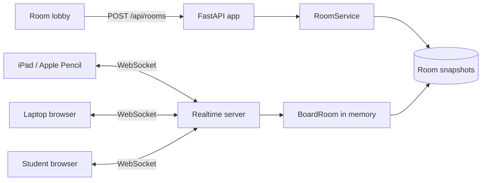

# Architecture

## Goal

`local-board` — room-based realtime-доска для занятий. Преподаватель создаёт комнату, отправляет ссылку или сообщает 4-значный код ученику, и все участники комнаты видят общий canvas во время рисования.

Текущий способ запуска — один Linux-хост в LAN. При этом приложение намеренно **host-agnostic**: frontend использует same-origin HTTP/WebSocket URLs и не знает, работает ли он на `192.168.x.x`, `localhost` или будущем HTTPS-домене.

Главный сценарий:

```text
teacher creates room
→ server persists room identity
→ teacher shares /b/<4-digit-code>
→ student opens the same URL or enters the code
→ both connect to the same BoardRoom
→ Pencil stroke renders locally immediately
→ append points are batched for network transport
→ mutation travels over WebSocket
→ server applies authoritative state
→ other participants render it live
→ durable snapshot is persisted
```

## Components



### Room lifecycle

Rooms are explicit resources.

1. `POST /api/rooms` allocates a free code from `0000` to `9999`.
2. An empty persisted board document is created immediately.
3. `/b/<room-code>` is available only for an existing room.
4. WebSocket connections are also rejected for unknown room codes.

A four-digit code is deliberately optimized for classroom UX, not security. It is easy to say/type but has only 10 000 variants. **Public deployment must never treat it as authorization**; owner/invite credentials are a separate future layer.

### Frontend

- native Canvas 2D with a dedicated `PencilEngine` separated from touch/mouse navigation;
- normal Pencil path is `pointerdown → pointermove* → pointerup`;
- `pointerType === "pen"` classifies normal pointer contacts, then tracked pointer identity is authoritative for that contact;
- WebKit recovery does **not** assume every fast `pointerdown`/`pointerup` will arrive perfectly;
- if no active stroke exists and a `pointermove` reports pen contact through `pressure > 0` or `buttons != 0`, that move reconstructs a missing `pointerdown` and starts the stroke immediately;
- iPad Safari also has a secondary Touch Events fallback: `Touch.touchType === "stylus"` is accepted only when Pointer Events did not establish the Pencil contact;
- stylus `touchend` is a secondary terminal signal, so a lost `pointerup` cannot leave Pencil state stuck between letters;
- a new normal Pencil `pointerdown` always wins: stale older Pencil state is finalized before the new stroke begins;
- Pencil does **not** use explicit `setPointerCapture()` / `releasePointerCapture()`; terminal pointer events are observed at `window` level;
- no artificial debounce/cooldown is allowed between Pencil contacts;
- no synchronous persistence or full-stroke cloning is allowed in Pencil down/move/up hot paths;
- undo records only the completed stroke id on Pencil release; a full stroke copy is created later only if Undo is actually requested;
- touch/palm never creates ink;
- while Pencil is active, finger/palm navigation is ignored so the canvas does not move under the hand;
- otherwise one finger pans and two fingers pinch-zoom;
- Safari text selection, touch callout, drag, context menu and browser gesture handling are suppressed on the board surface;
- coalesced Pencil samples are applied to local state immediately when available;
- rendering is scheduled at most once per animation frame;
- outgoing `stroke.append` points are batched once per animation frame in bounded chunks and flushed before `stroke.end`;
- realtime transport is downstream of local rendering and must never gate whether a Pencil contact is accepted;
- viewport (`x/y/zoom`) is local per browser and is never synchronized;
- API requests use relative same-origin paths;
- WebSocket derives `ws://` / `wss://` from `location.protocol`;
- share links use `location.origin`, so no host/IP is hardcoded.

### Backend

- FastAPI serves lobby, board UI, API and WebSocket endpoint;
- `RoomService` owns explicit room creation;
- `JsonBoardStore` owns durable room state for the current single-host deployment;
- one `BoardRoom` is the authoritative in-memory state for one active room;
- each mutation has `op_id`;
- sender receives `ack`;
- server remembers recent `op_id` values and ignores retries, making reconnect resend idempotent;
- completed mutations are persisted atomically.

## Realtime protocol

Client mutations:

- `stroke.begin`
- `stroke.append`
- `stroke.end`
- `stroke.delete`
- `stroke.restore`
- `board.clear`

Server messages:

- `snapshot` — full current board after connect/reconnect;
- `event` — mutation from another client;
- `ack` — confirms mutation from this client;
- `presence` — current connected-client count;
- `error` — rejected protocol message.

### Reconnect

The browser keeps unacknowledged operations in an outbox. After reconnect:

1. server sends the authoritative snapshot;
2. browser overlays its pending operations locally;
3. pending operations are resent;
4. duplicate `op_id` values are acknowledged but not applied twice.

This avoids losing a just-written stroke during a short Wi-Fi interruption.

## Persistence

Current single-host storage:

```text
~/.local/share/local-board/boards/<room-code>.json
```

Override with `LOCAL_BOARD_DATA_DIR`.

JSON is intentionally enough for the current LAN/single-instance phase. The room creation and realtime layers are separated from persistence so the future internet version can replace this with durable shared storage without changing canvas input or the browser protocol.

## Deployment boundary

### Current phase: LAN / one process

- one Uvicorn/FastAPI process;
- active room state is in memory;
- JSON snapshots are on local persistent disk;
- trusted/small room usage;
- no authentication yet.

### Future single-instance internet deployment

The same application can sit behind an HTTPS reverse proxy:

```text
Browsers
  ↓ HTTPS / WSS
Reverse proxy / TLS termination
  ↓ HTTP / WS
one Local Board application process
  ↓
persistent volume
```

Important: while `BoardRoom` state is process-local, run **one application worker**. Multiple workers would split participants of the same room unless a shared realtime/state layer is introduced.

Before exposing the service publicly, add at minimum:

- HTTPS/WSS;
- teacher ownership and participant permissions;
- a real authentication/invite credential independent of the 4-digit room code;
- rate limits for room creation and WebSocket traffic;
- WebSocket Origin/Host policy;
- request/body limits and abuse monitoring;
- persistent backups;
- secrets/config outside source control.

### Future multi-instance scale

If one process/server is no longer enough, add a shared coordination layer instead of relying on sticky sessions for correctness:

- shared durable DB for room metadata/state;
- Redis or another broker for cross-instance room events/presence;
- application instances become horizontally scalable;
- migrations/versioning become explicit.

CRDT should only be introduced when richer concurrent object editing actually requires it; realtime ink alone does not justify that complexity yet.

## Deliberate non-goals for the current version

- teacher/student roles;
- accounts/authentication;
- public internet hardening;
- multi-process horizontal scaling;
- text/shapes/images/PDF objects;
- lesson scheduling/history UI.

These are future product layers, not reasons to compromise the current realtime ink path.

See [`deployment.md`](deployment.md) for the staged deployment plan.
