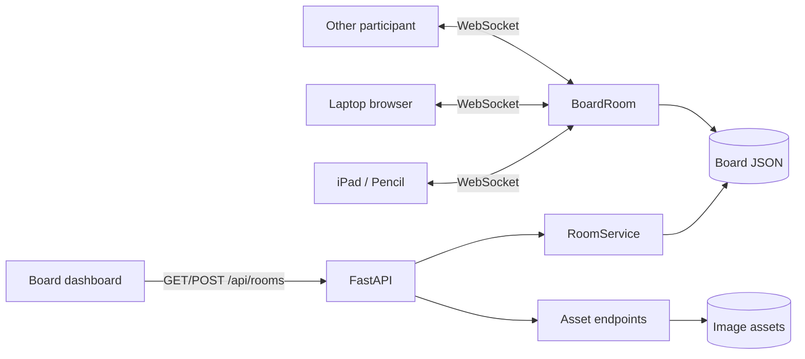

# Architecture

## Goal

`local-board` — room-based realtime-доска для совместных занятий и работы. Один участник создаёт доску, делится ссылкой или 4-значным кодом, и все участники видят общий canvas в realtime.

Текущий deployment — один Linux-хост в LAN. Frontend остаётся **host-agnostic**: same-origin HTTP/WebSocket работает одинаково на `localhost`, LAN-IP и будущем HTTPS-домене.

Главный flow:

```text
Dashboard / → explicit room
→ participants join /b/<code>
→ local optimistic ink/object interaction
→ validated realtime mutation
→ authoritative BoardRoom
→ event to peers
→ durable JSON snapshot + separate image assets
```

## Components



## Room/dashboard lifecycle

1. `POST /api/rooms` allocates a free code `0000..9999`.
2. Empty room state is persisted immediately.
3. `GET /api/rooms` lists persisted boards by last modified time for the dashboard.
4. `/b/<code>` and `/ws/<code>` exist only for known rooms.

The 4-digit code is classroom UX, **not authorization**. Public deployment needs a separate invite/owner credential.

## Shared board model

The room has two persistent content types:

```text
strokes[]  # freehand ink
objects[]  # positioned board objects; currently image
```

Images are deliberately **not base64-embedded in board JSON/WebSocket events**. The browser uploads bytes to:

```text
POST /api/boards/<room>/assets
```

and the shared object contains only same-room metadata:

```text
{
  id,
  kind:"image",
  x, y, width, height,
  src, name,
  crop_x, crop_y, crop_width, crop_height
}
```

Crop values are normalized fractions of the original asset. Cropping is therefore non-destructive: the original bytes remain untouched and only object metadata changes.

`objects[]` order is also meaningful: it is the image stacking order. `object.reorder` moves an image to the front or back of the image layer and the resulting order is persisted by snapshot. Ink is still rendered above the image layer.

Assets live under `~/.local/share/local-board/assets/<room>/`. The server rejects cross-room image references in `object.create`.

## Frontend responsibilities

### Ink/input

- native Canvas 2D; no whiteboard framework dependency;
- dedicated `PencilEngine` owns the active freehand stroke independently of navigation logic;
- default input remains conservative: Apple Pencil draws, one finger pans, two fingers pinch, mouse pans;
- normal Pencil path is `pointerdown → pointermove* → pointerup` plus WebKit recovery from contact-bearing `pointermove` and stylus `TouchEvent` fallback;
- Pencil ink has no debounce/cooldown and no synchronous persistence in the hot path;
- coalesced samples render locally before network transport;
- a separate local `directInkEnabled` preference may deliberately route Pen-tool mouse/touch contacts into `PencilEngine` with `pointer_type` equal to `mouse` or `touch`;
- direct ink is **off by default** and stored per browser, so enabling it for one participant does not alter other participants;
- with direct ink enabled, Pen + LMB/one finger draws and Eraser + one finger can erase; selecting Pan still routes mouse/touch to navigation;
- two-finger pinch remains available in direct-ink mode: when a second touch arrives, any transient first-finger ink is cancelled and the contacts are converted to the ordinary pinch gesture;
- Apple Pencil retains priority over finger/palm input even when direct ink is enabled;
- eraser deletes whole ink strokes and is undoable through the local history controller;
- Safari selection/callout/drag/gesture handling is suppressed on the board surface.

### Selection/object editing

`SelectionController` owns local selection, contextual image actions and crop interaction state. Selection outlines, marquee rectangles, contextual UI and an in-progress crop frame are **not shared room state**.

Supported interactions:

- Select tool (`V`);
- click hit-test;
- a marquee is **pending until a real drag threshold is crossed** (6 CSS px mouse/pen, 10 CSS px touch); pointerdown alone never paints the blue rectangle;
- selected objects also use a drag threshold before moving, preventing click jitter from shifting content;
- `Shift` additive selection;
- `Ctrl/Cmd+A` select all;
- `Esc` clear selection / cancel crop;
- `Delete/Backspace` deletes selected strokes/images;
- `Ctrl/Cmd + drag` temporarily routes input to Select without changing the active tool;
- held RMB drag is a temporary marquee gesture independent of the selected tool; a plain RMB click does nothing;
- selected strokes and image objects can move;
- a single selected image can resize from its corner while preserving aspect ratio;
- when exactly one image is selected, a local contextual toolbar is anchored to that image instead of adding image actions to the global bottom toolbar;
- contextual image actions: crop, copy, duplicate, image-layer front/back, reset crop and delete;
- `Ctrl/Cmd+C` stores the selected image object for board-local paste, `Ctrl/Cmd+V` duplicates it when the system clipboard does not contain an external image file, and `Ctrl/Cmd+D` duplicates directly;
- double-clicking a selectable image enters crop mode;
- crop mode has eight handles plus a draggable crop area and explicit Apply/Cancel.

Transforms are committed as semantic realtime mutations (`stroke.translate`, `object.update`, `object.reorder`) rather than retransmitting historical points/image bytes. Applying crop commits geometry plus normalized `crop_*` values in one `object.update`, so peers and reconnect snapshots render the same crop.

### Images

`AssetController` supports:

- Image toolbar button / file picker;
- drag&drop onto the canvas;
- paste from clipboard;
- PNG/JPEG/WEBP/GIF up to the current server limit;
- upload first, then `object.create` with same-origin asset URL;
- image bytes are fetched/cached independently by `ImageCache`;
- `CanvasRenderer` uses the 9-argument Canvas `drawImage` form to display the selected source crop inside the board object's destination rectangle.

### Rendering

- completed ink + image objects are cached into a bitmap base layer;
- only active ink and local interaction overlays are repainted every display frame;
- image cache invalidates the base only when an image finishes loading;
- selection, marquee and crop overlays are local-only;
- crop dimming is confined to the selected image rectangle, not the whole board;
- PNG export suppresses local interaction overlays;
- viewport (`x/y/zoom`) remains local per browser.

## Camera assistance

`source_zoom` on new strokes is descriptive metadata only. Camera helpers remain local:

- **auto-follow** controls whether a passive viewer pans toward remote active writing;
- **auto-scale** independently controls whether viewer zoom approaches the writer's `source_zoom`;
- both preferences are local and remembered separately;
- local writing/pan/pinch/wheel immediately wins and pauses automatic movement;
- camera target is retargetable and eased rather than packet-jumped;
- **⌖** returns to the last writing location;
- zoom percentage displays actual local zoom; clicking it returns to 100% around current viewport center.

No role names such as teacher/student are part of this engine.

## Realtime protocol

Client mutations:

- `stroke.begin`
- `stroke.append`
- `stroke.end`
- `stroke.delete`
- `stroke.restore`
- `stroke.translate`
- `object.create`
- `object.update`
- `object.reorder`
- `object.delete`
- `board.clear`

Server messages:

- `snapshot`
- `event`
- `ack`
- `presence`
- `error`

Every mutation carries `op_id`; retries are deduplicated server-side. Structural mutations are persisted atomically. Reconnect starts from authoritative snapshot and resends pending operations.

## Persistence

```text
~/.local/share/local-board/boards/<room>.json
~/.local/share/local-board/assets/<room>/<asset>
```

Override the root with `LOCAL_BOARD_DATA_DIR`.

JSON + filesystem assets intentionally fit the current single-process phase. Persistence, room state and transport are separated so a future internet deployment can replace storage without rewriting input/selection/rendering logic.

## Deployment boundary

### Current phase

- one Uvicorn/FastAPI process;
- active `BoardRoom` state is process-local;
- persistent JSON + image files on one disk;
- trusted/small-room usage;
- no authentication.

### Public single-instance phase

```text
Browsers
  ↓ HTTPS / WSS
Reverse proxy / TLS or outbound tunnel
  ↓
one Local Board process
  ↓
persistent volume
```

While `BoardRoom` is in memory, run **one application worker**. Before permanent public exposure add at minimum HTTPS/WSS, ownership/invite auth separate from room code, rate limits, Origin/Host checks, upload/request limits, backups and abuse monitoring.

### Multi-instance phase

When one process is insufficient, introduce shared durable room metadata/state plus a cross-instance event/presence layer (for example Redis/broker). Do not merely start multiple workers and hope clients land on the same process.

CRDT remains optional and should be introduced only when richer concurrent object editing actually requires it.

## Deliberate non-goals for 0.4

- fixed teacher/student behavior in drawing engine;
- accounts/authentication;
- public internet hardening;
- multi-process horizontal scaling;
- rich text/sticky notes/connectors/PDF-page objects;
- lesson scheduling/history product layer.

Images, contextual image editing, non-destructive crop and basic object selection are part of the implemented board model; richer object types can extend the same protocol/state seams later.

See [`deployment.md`](deployment.md) for the staged deployment plan.
